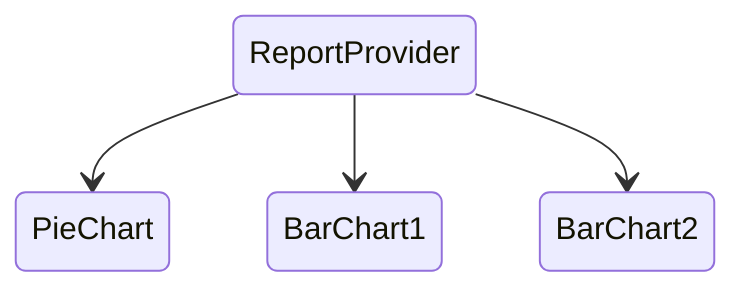
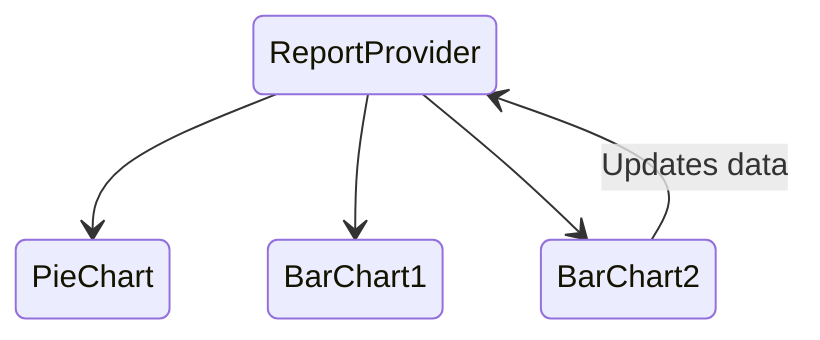
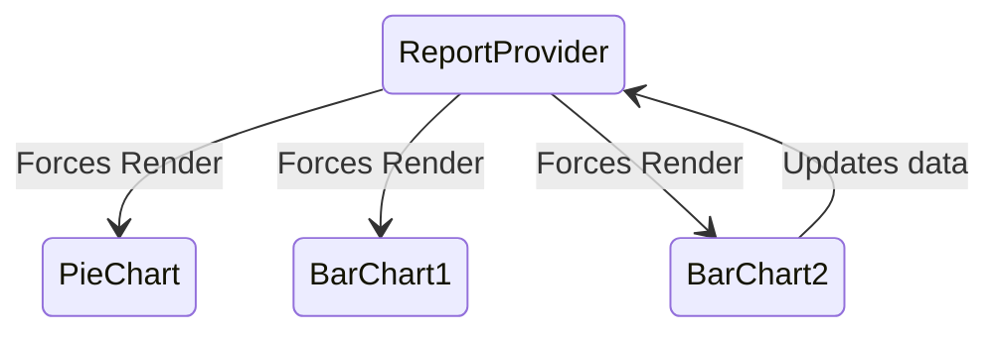

#### Beyond Context: Atomic State Management

Tim Waite

---

### The Problem

```tsx
export default function App() {
  return (
    <RouterProvider>
      <QueryParamProvider adapter={ReactRouter6Adapter}>
        <AuthProvider>
          <BrowserCompatabilityProvider>
            <QueryClientProvider client={client}>
              <TeamProvider>
                <KeyboardShortcutsProvider>
                  <DndProvider backend={HTML5Backend}>
                    <Layout>
                      <Outlet />
                    </Layout>
                  </DndProvider>
                </KeyboardShortcutsProvider>
              </TeamProvider>
            </BrowserCompatabilityProvider>
          </QueryClientProvider>
        </AuthProvider>
      </QueryParamProvider>
    </RouterProvider>
  );
}
```

note: This is copied from a real app

---

### Even Deeper

```tsx
{/* Some complicated page */}
<AllTasksProvider>
  <ReportProvider>
    <ReportLayout>
      Lots of consumers
    <TasksDialog />
  </ReportProvider>
</AllTasksProvider>
```

_Yes, this is a real example_ <!-- element class="fragment" -->

_Yes, I wrote this code 🤦‍♂️_ <!-- element class="fragment" --> 

---

### Why This Can Kill Your Performance

> Context can only store a single value, not an indefinite set of values each with its own consumers.

This means any function or state value that changes will re-render all consumers.

---

### In Code

```tsx
function MyContext(props) {
  // ...
  return (
    <Context.Provider
      value={{
        tasksLoading,
        fetchTasksCalled,
        error,
        fetchAllTasks,
        filters,
        handleDownload,
        handleChartClick,
        isExporting,
        isPrinting,
        isDialogOpen,
        companyName,
        hasCustomCharts,
        rootEl,
        setFilters,
        updateChartStatus, // Uh oh!
        // ...
      }}
    >
      {props.children}
    </Context.Provider>
  );
}
```

note: this was lifted from a codebase

---

### Re-rendering



---

### Re-rendering



---

### Re-rendering



---

### Outline

- The Problem ✅
- A Solution: Atomic state management <!-- element class="fragment" -->
- Library Options <!-- element class="fragment" -->
- When, Why & Tradeoffs <!-- element class="fragment" -->
- Practical Example <!-- element class="fragment" -->

---

### A Solution

Atomic state management.

- Atoms
- Selectors
- Effects

---

### Atoms

Atoms are just state.

```tsx
const theme = atom({
  key: "state",
  default: "dark",
});

function Button() {
  const [theme, setTheme] = useRecoilValue(theme);

  // ...
}
```

---

### Selectors

```tsx
const todoListFilterState = atom({
  key: "TodoListFilter",
  default: "Show All",
});
```

```tsx
const filteredTodoListState = selector({
  key: "FilteredTodoList",
  get: ({ get }) => {
    const filter = get(todoListFilterState);
    const list = get(todoListState);

    switch (filter) {
      case "Show Completed":
        return list.filter((item) => item.isComplete);
      case "Show Uncompleted":
        return list.filter((item) => !item.isComplete);
      default:
        return list;
    }
  },
});
```

---

### Context Memos

```tsx
function Provider(props) {
  const [todos, setTodos] = React.useState([/* ... */]);

  const complete = React.useMemo(/* ... */, [todos]);
  const uncomplete = React.useMemo(/* ... */, [todos]);

  return (
    <Provider value={{ todos, complete, uncomplete }}>
      {props.children}
    </Provider>
  );
}
```

```tsx
// Will rerender if completed todos changes!?
function FinishedTodos() {
  const { complete } = React.useContext(TodoContext);

  // ...
}
```

---

### Demo

[Sandbox URL](https://codesandbox.io/p/sandbox/spring-night-8h4st9)

---

### Effects

Instead of `useEffect` these libraries typically offer their own effects:

```tsx
const theme = atom({
  key: "state",
  default: "dark",
  effects: [
    ({ onSet }) =>
      onSet((newTheme) => console.log("Theme changed to: ", newTheme)),
  ],
});
```

---

### Effects

It's strongly encouraged that you to embrace the effects of the library since they can be co-located. Although you can still run `useEffect` and modify the data.

---

### Effects - Use Cases

- Logging
- History
- Storage Persistance

---

### Libraries

- [Jotai](https://jotai.org/docs/core/atom)
- [Recoil](https://recoiljs.org/)
- [Zustand](https://github.com/pmndrs/zustand)

---

### When To Consider Atomic State

- You have a lot of nested providers in your application
- You have lots of independent pieces of state that don't need to interact <!-- element class="fragment" -->
- You need to rapidly onboard engineers, or handoff to another team <!-- element class="fragment" -->
- You care more about how the state is modified than the state itself, eg state machines <!-- element class="fragment" -->
- You hate boilerplate <!-- element class="fragment" -->

---

### Tradeoffs

- More dependencies (insert NPM meme)
- Flexibility can make it hard to reason about state changes <!-- element class="fragment" -->
- Large amounts of atoms can actually start having counteracting performance benefits <!-- element class="fragment" -->
- Lack of structured flow, which can make it more challenging to reason about <!-- element class="fragment" -->

---

### Practical Example

### Questions?

[github.com/twaite/react-meetup-recoil](https://github.com/twaite/react-meetup-recoil)